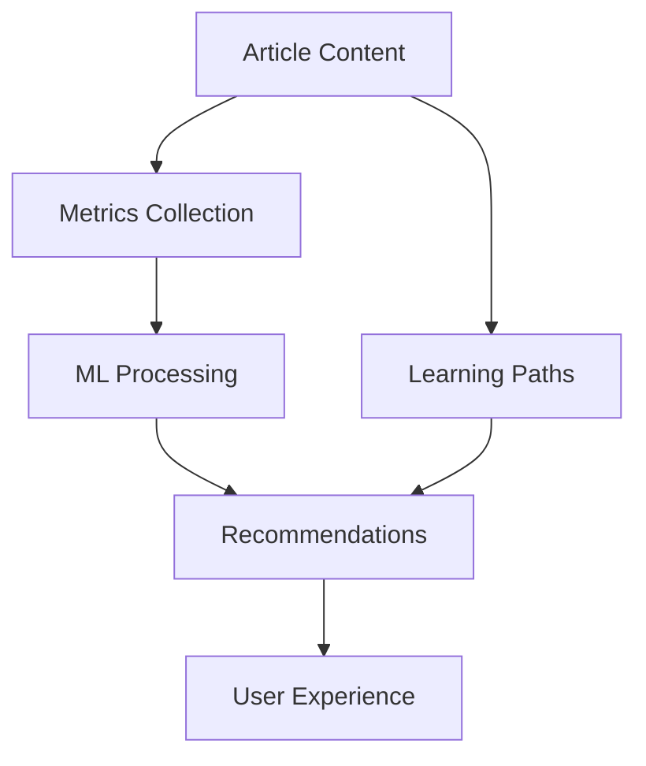

# Articles System Documentation

## Overview

The Articles system is a sophisticated content management solution designed to support rich technical content with built-in support for machine learning-based recommendations and learning path generation. It provides a robust foundation for creating, managing, and delivering educational content while collecting valuable metrics for content optimization and personalized learning experiences.

## Purpose & Strategy

### Business Objectives

The Articles system serves two primary purposes:

1. **SEO & Content Discovery**
   - Maximize search engine visibility through structured content
   - Create entry points for organic traffic
   - Build authority in technical topics
   - Generate qualified leads for future training offerings

2. **Foundation for Future Training**
   - Establish content foundation before full training platform
   - Validate topics and approaches with real users
   - Build audience and credibility
   - Gather data for future course development

### User Benefits

1. **Immediate Value**
   - Free, high-quality technical content
   - Structured learning paths
   - Clear progression through topics
   - Practical, applicable knowledge

2. **Future Opportunities**
   - Seamless transition to full training platform
   - Preview of more comprehensive content
   - Community engagement
   - Professional development tracking

### Strategic Approach

1. **Phase 1: Content Foundation** (Current)
   - Focus on SEO-optimized article sequences
   - Build comprehensive topic coverage
   - Establish content quality standards
   - Implement basic analytics

2. **Phase 2: Engagement** (Near Future)
   - Add user accounts
   - Track progress
   - Enable bookmarking
   - Implement basic assessments

3. **Phase 3: Training Platform** (Future)
   - Launch full training courses
   - Add interactive elements
   - Implement certification
   - Provide mentorship options

### Key Differentiators

1. **Content Quality**
   - Professional-grade technical content
   - Practical, real-world examples
   - Clear learning progression
   - Regular updates

2. **User Experience**
   - Seamless navigation
   - Logical content organization
   - Mobile-friendly design
   - Fast loading times

3. **Technical Depth**
   - Comprehensive coverage
   - Advanced topics
   - Industry best practices
   - Expert perspectives

## Architecture

### Core Components



### Data Flow

1. Content Creation & Management
2. Metrics Collection & Analysis
3. ML Processing & Feature Generation
4. Recommendation Engine
5. Learning Path Generation
6. User Interaction & Feedback Loop

## Data Model

### Core Article Structure

```typescript
interface Article {
  // Basic Metadata
  id: string
  title: string
  subtitle?: string
  slug: string
  status: 'draft' | 'published' | 'archived'
  
  // Content
  content: RichTextContent
  excerpt: string
  featuredImage: MediaRelation
  
  // Categorization
  categories: Category[]
  tags: string[]
  difficulty: 'beginner' | 'intermediate' | 'advanced'
  
  // SEO & Distribution
  meta: {
    title?: string
    description?: string
    keywords?: string[]
  }
}
```

### Tutorial Structure

```typescript
interface Tutorial {
  // Basic Metadata
  id: string
  title: string
  slug: string
  status: 'draft' | 'published' | 'archived'
  
  // SEO Optimized Content
  meta: {
    title: string // SEO optimized title
    description: string // SEO description
    keywords: string[]
    canonicalUrl?: string
    structuredData?: {
      "@type": "Course" | "TutorialSeries"
      // Other schema.org properties
    }
  }
  
  // Tutorial Overview
  overview: {
    shortDescription: string // For listings
    longDescription: string // For tutorial page
    mainTechnology: string
    level: 'beginner' | 'intermediate' | 'advanced'
  }
  
  // Article Sequence
  articles: {
    article: {
      id: string
      title: string // Can be different from article's title for sequence coherence
      slug: string
    }
    order: number
    seoTitle?: string // Optional override for this context
    seoDescription?: string // Optional override for this context
  }[]
  
  // Simple Metrics
  metrics?: {
    views: number
    uniqueViews: number
    averageTimeOnPage: number
    searchImpressions: number
    searchClicks: number
    searchPosition: number
  }
  
  // Future Extension Points
  training?: {
    isAvailable: boolean
    trainingId?: string // Reference to future training system
  }
  
  // Basic categorization for navigation and SEO
  categories: string[]
  tags: string[]
  
  // Timestamps
  createdAt: string
  updatedAt: string
  publishedAt?: string
}

// Simplified references
interface ArticleReference {
  id: string
  title: string
  slug: string
}

// Future extension point
interface TrainingReference {
  id: string
  type: 'course' | 'workshop' | 'certification'
  // To be expanded in future
}
```

### Example Usage

```typescript
const tutorial: Tutorial = {
  title: "Getting Started with TypeScript",
  slug: "typescript-getting-started",
  status: "published",
  
  meta: {
    title: "TypeScript Tutorial for Beginners: A Complete Guide [2024]",
    description: "Learn TypeScript from scratch with this comprehensive tutorial series. Perfect for JavaScript developers looking to enhance their skills with static typing.",
    keywords: ["typescript tutorial", "learn typescript", "typescript for beginners", "typescript guide"],
    structuredData: {
      "@type": "Course",
      "name": "TypeScript Tutorial for Beginners",
      "description": "Comprehensive TypeScript tutorial series for JavaScript developers"
    }
  },
  
  overview: {
    shortDescription: "Start your TypeScript journey with this beginner-friendly tutorial series",
    longDescription: "Comprehensive guide to TypeScript fundamentals, perfect for JavaScript developers wanting to add static typing to their skillset.",
    mainTechnology: "TypeScript",
    level: "beginner"
  },
  
  articles: [
    {
      article: {
        id: "intro-typescript",
        title: "Introduction to TypeScript",
        slug: "introduction-typescript"
      },
      order: 1,
      seoTitle: "TypeScript Introduction: What is TypeScript and Why Use It?",
      seoDescription: "Learn what TypeScript is, its benefits over JavaScript, and why it's becoming essential in modern web development."
    },
    {
      article: {
        id: "typescript-types",
        title: "Basic Types in TypeScript",
        slug: "typescript-basic-types"
      },
      order: 2,
      seoTitle: "TypeScript Types: Complete Guide to Basic Types [With Examples]",
      seoDescription: "Explore TypeScript's basic types including numbers, strings, arrays, and objects with practical examples."
    }
  ],
  
  categories: ["TypeScript", "Web Development", "Programming Languages"],
  tags: ["typescript", "javascript", "web development", "static typing"],
  
  createdAt: "2024-01-01T00:00:00Z",
  updatedAt: "2024-01-15T00:00:00Z",
  publishedAt: "2024-01-15T00:00:00Z",
  
  // Optional future extension
  training: {
    isAvailable: false
  }
}
```

### ML & Recommendations Extensions

```typescript
interface MLFeatures {
  contentEmbedding: Vector
  similarityScores: ArticleSimilarity[]
  conceptEmbeddings: ConceptEmbedding[]
}

interface ArticleMetrics {
  engagement: EngagementMetrics
  learning: LearningMetrics
  content: ContentMetrics
}
```

## Features

### Content Management

- Rich text editing with code support
- Media management
- Version control
- Multi-language support
- SEO optimization
- Content validation

### Learning Features

- Difficulty levels
- Prerequisites tracking
- Learning outcomes
- Progress tracking
- Knowledge graph integration
- Concept mapping

### Analytics & Metrics

- Engagement tracking
- Reading time analytics
- User progression
- Content effectiveness
- Learning path optimization
- A/B testing support

### Machine Learning Capabilities

- Content similarity analysis
- Personalized recommendations
- Learning path generation
- Concept difficulty assessment
- User behavior analysis
- Content quality prediction

## Implementation Guidelines

### Creating New Articles

```typescript
// Example of article creation
const article: Article = {
  title: "Understanding TypeScript Generics",
  difficulty: "intermediate",
  prerequisites: ["basic-typescript", "javascript-fundamentals"],
  content: {
    // Rich text content
  },
  learningOutcomes: [
    "Understand generic syntax",
    "Implement generic functions",
    "Use constraints effectively"
  ]
}
```

### Creating New Tutorials

```typescript
// Example of tutorial creation with articles
const tutorial: Tutorial = {
  title: "Mastering TypeScript Advanced Concepts",
  description: "A comprehensive guide to advanced TypeScript features",
  status: "published",
  
  objectives: [
    "Master generics and type manipulation",
    "Understand decorators and metadata",
    "Implement advanced design patterns"
  ],
  
  prerequisites: {
    tutorials: [
      { id: "ts-basics", title: "TypeScript Fundamentals", slug: "typescript-fundamentals" }
    ],
    skills: ["JavaScript", "Basic TypeScript", "OOP concepts"],
    experience: ["1 year of JavaScript development"]
  },
  
  articles: [
    {
      article: {
        id: "advanced-types",
        title: "Advanced Types in TypeScript",
        slug: "advanced-types",
        order: 1
      },
      order: 1,
      isOptional: false,
      objectives: ["Understand mapped types", "Master conditional types"],
      estimatedTime: 30
    },
    {
      article: {
        id: "decorators",
        title: "TypeScript Decorators",
        slug: "decorators",
        order: 2
      },
      order: 2,
      isOptional: false,
      objectives: ["Implement class decorators", "Create method decorators"],
      estimatedTime: 45
    }
  ],
  
  progression: {
    totalSteps: 2,
    estimatedTotalTime: 75,
    difficulty: "advanced",
    learningPath: {
      current: {
        id: "advanced-types",
        title: "Advanced Types in TypeScript",
        slug: "advanced-types",
        order: 1
      },
      next: [{
        id: "decorators",
        title: "TypeScript Decorators",
        slug: "decorators",
        order: 2
      }],
      previous: []
    }
  },
  
  mainTechnology: "TypeScript",
  supportingTechnologies: ["Node.js", "VS Code"],
  concepts: ["types", "decorators", "metadata", "reflection"],
  
  level: {
    minimum: "intermediate",
    recommended: "advanced"
  },
  
  meta: {
    title: "Master TypeScript Advanced Concepts",
    description: "Deep dive into advanced TypeScript features and patterns",
    timeToComplete: "2 hours",
    certification: {
      available: true,
      provider: "Platform Name",
      level: "Advanced"
    }
  }
}
```

### Handling Recommendations

```typescript
// Example of recommendation generation
async function getRecommendations(articleId: string): Promise<Article[]> {
  const article = await getArticle(articleId)
  const recommendations = await generateRecommendations({
    contentSimilarity: true,
    learningPath: true,
    userProgress: true
  })
  return recommendations
}
```

## Best Practices

### Content Structure

1. Use clear hierarchical headings
2. Include practical examples
3. Link to prerequisites
4. Provide complete code samples
5. Include visual explanations
6. Tag with relevant concepts

### ML Optimization

1. Regularly update embeddings
2. Validate recommendation quality
3. Monitor engagement metrics
4. Update learning paths
5. Maintain concept relationships
6. Review automated suggestions

## Future Evolution

### Planned Enhancements

- Interactive code playgrounds
- Real-time collaboration
- Advanced visualization tools
- Enhanced ML models
- Community contributions
- Automated assessments

### Scalability Considerations

- Content versioning
- Caching strategies
- ML pipeline optimization
- Data storage optimization
- Performance monitoring
- Load balancing

## API Reference

### Content Management

```typescript
interface ArticleAPI {
  create(data: ArticleInput): Promise<Article>
  update(id: string, data: Partial<ArticleInput>): Promise<Article>
  delete(id: string): Promise<void>
  publish(id: string): Promise<Article>
  unpublish(id: string): Promise<Article>
}
```

### ML & Recommendations

```typescript
interface RecommendationAPI {
  getSimilarArticles(articleId: string): Promise<Article[]>
  generateLearningPath(concepts: string[]): Promise<Article[]>
  updateEmbeddings(articleId: string): Promise<void>
  getNextSteps(articleId: string, userId: string): Promise<Article[]>
}
```

## Contributing

### Development Workflow

1. Fork the repository
2. Create a feature branch
3. Implement changes
4. Add tests
5. Update documentation
6. Submit pull request

### Code Standards

- Follow TypeScript best practices
- Maintain type safety
- Document public APIs
- Write unit tests
- Follow naming conventions
- Use consistent formatting

## Support

For technical support and feature requests, please:

1. Check existing documentation
2. Review known issues
3. Submit detailed bug reports
4. Engage with the development team
5. Propose enhancements

---

## Changelog

### Version 1.0.0

- Initial documentation
- Core feature description
- ML integration details
- API reference
- Contributing guidelines 