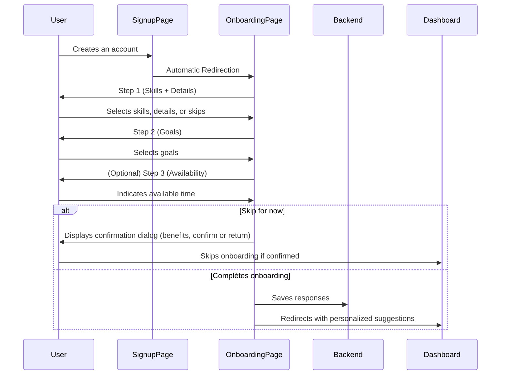

# User Onboarding System After Signup

## 1. Objective
Permit each new user to input their current technical skills and learning goals immediately after account creation. This information will be used to personalize their experience, provide tailored suggestions, and track their progress.

---

## 2bis. Technical Implementation: Single Page and Dedicated Table

### Single Page `/auth/onboarding?step=...`
- The onboarding process will take place on a single page `/auth/onboarding`.
- The current step is determined by the URL parameter `step` (e.g., `?step=1`, `?step=2`, `?step=3`, `?step=done`).
- Smooth navigation between steps without full page reloads.
- Direct access to a specific step should be possible (useful for resuming or sharing links).
- Planned steps:
  - `step=1`: Skills Selection
  - `step=2`: Goals Selection
  - `step=3`: Availability/Time
  - `step=done`: Congratulations/Finish
  - (optional) `step=confirm-skip`: Confirmation dialog for cancellation/skip

### Dedicated User Onboarding Table
- Suggested name: `user_onboarding` or `onboarding_info`
- Fields:
  - `user_id` (foreign key, unique)
  - `skills` (array or JSON, optional)
  - `skills_details` (array or JSON, optional)
  - `goals` (array or JSON, optional)
  - `custom_goal` (string, optional)
  - `availability` (int or string, optional)
  - `skipped` (bool, **required**)
  - `completed_at` (timestamp, optional)
  - `updated_at` (timestamp, auto)
- Logic:
  - If the user skips onboarding, `skipped = true` and other fields remain empty.
  - If the user completes onboarding, `skipped = false` and fields are populated based on their answers.
  - Onboarding information can be modified later (from the profile).

---

## 2. Onboarding Workflow After Signup
- After account creation (following an invited challenge or classic signup), the user is automatically redirected to an onboarding screen.
- The onboarding will consist of several steps:
  1. **Selection of current skills** (with detailed concept selection)
  2. **Choice of learning goals**
  3. **(Optional) Weekly availability/time commitment**
- Users can choose to skip onboarding at any time ("Skip for now").
- **When the user wants to cancel or skip onboarding, a confirmation dialog will appear** to prevent accidental cancellations. This dialog should explain the benefits of onboarding and offer the choice to confirm or return to the onboarding process.
- As long as their skills are not provided, they can redo the onboarding later (via reminders or access from the profile).
- The user can always modify their preferences and learning desires in their profile at any time.
- At the end, the responses are saved in the user profile (backend).
- The user is then redirected to a dashboard or a personalized suggestions page.

---

## 3. Onboarding Steps

### a) General Experience Information
- **First page**:
  - Ask the user **how long they have been coding** (e.g., less than 6 months, 6-12 months, 1-2 years, 2-5 years, 5+ years, etc.).
  - Ask the user **their estimated level**: beginner, intermediate, advanced, expert (single selection).

### b) Current Skills (with Details)
- **Second page**:
  - First select: **skills/technologies** (HTML, CSS, JS, React, Node, SQL, Python, Docker, etc.).
  - When a skill is selected, a **second dynamic select** appears with all the **associated concepts** for that skill.
  - Concepts are **categorized** (ex: for Python: "Basic Programming", "OOP", "Web", "Data Science", etc.).
  - The user can **check individual concepts**, **check an entire category**, or **check all** concepts at once.
  - The user can skip the detailed concept selection for each skill if they wish.

### c) Learning Goals
- The user chooses what they want to learn or improve (ex: "Become fullstack", "Master React", "Learn DevOps", "Prepare for an interview", etc.)
- Possibility to select multiple goals or enter a custom goal.

### d) (Optional) Weekly Availability/Time
- The user indicates how much time they want to dedicate to the platform (ex: slider, quick selection).

---

## 4. Data Storage and Usage
- Responses are stored in the user profile (either in the `users` table or dedicated tables like `user_skills`, `user_goals`).
- This data is used to:
  - Tailor suggestions for challenges, courses, and articles.
  - Display a personalized dashboard upon first login.
  - Offer adapted notifications/reminders.
- Users can modify these choices at any time in their profile.
- As long as onboarding is not completed, the platform can remind or re-propose onboarding to the user.

---

## 5. UX Best Practices
- Onboarding should be quick, clear, and non-blocking (with a "Skip for now" option at each step).
- **Display a confirmation dialog if the user attempts to cancel or skip onboarding to prevent accidental cancellations. This dialog should explain the benefits of onboarding and offer the choice to confirm or return.**
- Use dropdowns, checkboxes, sliders to facilitate input.
- For each skill added, offer detailed concept selection (ex: frameworks, paradigms, application areas).
- Display a personalized welcome message at the end.
- The user can redo or complete onboarding as long as their skills are not provided.
- The user can modify their preferences and learning goals at any time in their profile.

---

## 6. Flow Diagram (Mermaid)

---

## 7. Points of Attention and Future Enhancements
- The onboarding relies on a dedicated table; all information is optional except `skipped` (required).
- Plan for the ability to complete or modify onboarding later (in the profile).
- Adjust the granularity of skills/goals based on platform evolution.
- Use this data for proactive suggestions, personalized paths, and targeted notifications.
- Plan for integration with other systems (gamification, progression, etc.).

---

*Reference document for the implementation and evolution of the user onboarding system after signup.* 