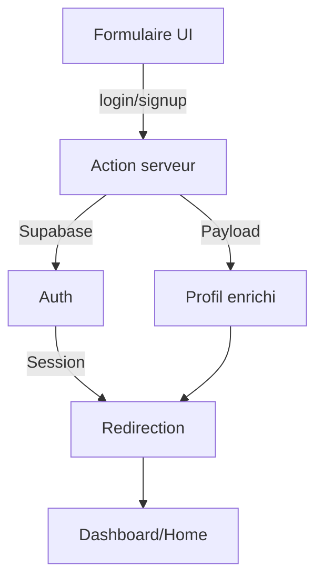

# Rapport sur le système d'authentification de la plateforme

## 1. Vue d'ensemble

Le système d'authentification de la plateforme combine **Supabase Auth** (gestion des comptes, sessions, OAuth) et **Payload CMS** (stockage des profils enrichis). Il est conçu pour la sécurité, la robustesse et la séparation stricte des responsabilités.

---

## 2. Parcours utilisateur

### a. Inscription (Signup)
- **UI** : Formulaire interactif (`SignUpCard`) avec validation et feedback.
- **Action serveur** : `signup` (dans [`src/actions/auth.ts`](mdc:src/actions/auth.ts))
  - Crée l'utilisateur dans Supabase.
  - Crée le profil enrichi dans Payload CMS (`createInitialUserInformation`).
  - Initialise la gamification.
  - Redirige vers `/home`.

### b. Connexion (Login)
- **UI** : Formulaire (`LoginCard`) avec gestion des erreurs et throttling.
- **Action serveur** : `login`
  - Authentifie via Supabase.
  - Limite les tentatives (throttling Redis).
  - Redirige vers `/home`.

### c. Connexion OAuth (Google, GitHub)
- **Actions** : `loginWithGoogle`, `loginWithGitHub`
  - Démarre le flow OAuth via Supabase.
  - Redirige vers `/auth/callback` pour finaliser la session.

### d. Déconnexion (Logout)
- **Action** : `logout`
  - Termine la session Supabase.
  - Redirige vers `/auth/login`.

---

## 3. Gestion des données utilisateur

- **Types** : Validation forte via Zod et TypeScript ([`src/core/user/types.ts`](mdc:src/core/user/types.ts), [`src/types/user.ts`](mdc:src/types/user.ts)).
- **Stockage** :
  - **Supabase** : Authentification de base (email, password, id).
  - **Payload CMS** : Profil enrichi (`user-informations`), lié par `userId` Supabase.
- **Accès côté client** :
  - Hook React Query `useSessionUser` ([`src/core/user/hooks/use-user.ts`](mdc:src/core/user/hooks/use-user.ts))
  - Appelle `getUser` (serveur) pour obtenir l'utilisateur enrichi.

---

## 4. Gestion des erreurs et sécurité

- **Erreurs personnalisées** :
  - Email déjà utilisé, mot de passe faible, identifiants invalides, email non vérifié, etc. ([`src/core/user/errors.ts`](mdc:src/core/user/errors.ts))
- **Pattern Result** :
  - Toutes les actions serveur retournent `{ success: true, value }` ou `{ success: false, error }` ([`src/core/user/result.ts`](mdc:src/core/user/result.ts))
- **Throttling** :
  - Limite les tentatives de login pour éviter le brute-force.
- **Validation** :
  - Types, schémas Zod, vérification côté serveur et client.

---

## 5. Séparation des responsabilités et architecture

- **Actions serveur** : Orchestration, logique métier, accès aux données.
- **Hooks** : Récupération/mutation des données côté client.
- **Composants** : UI pure, feedback utilisateur, aucune logique métier complexe.
- **Respect du Single Responsibility Principle** : Chaque fichier/composant a une responsabilité claire.

---

## 6. Références de fichiers clés

- Actions serveur : [`src/actions/auth.ts`](mdc:src/actions/auth.ts)
- Logique utilisateur : [`src/core/user/index.ts`](mdc:src/core/user/index.ts)
- Types : [`src/core/user/types.ts`](mdc:src/core/user/types.ts), [`src/types/user.ts`](mdc:src/types/user.ts)
- Erreurs : [`src/core/user/errors.ts`](mdc:src/core/user/errors.ts)
- Hooks : [`src/core/user/hooks/use-user.ts`](mdc:src/core/user/hooks/use-user.ts)
- UI : [`src/app/(frontend)/auth/components/LoginCard.tsx`](mdc:src/app/(frontend)/auth/components/LoginCard.tsx), [`src/app/(frontend)/auth/components/SignUpCard.tsx`](mdc:src/app/(frontend)/auth/components/SignUpCard.tsx)
- Callback OAuth : [`src/app/(frontend)/auth/callback/route.ts`](mdc:src/app/(frontend)/auth/callback/route.ts)

---

## 7. Points forts

- **Modularité** : Découpage strict entre UI, logique serveur, hooks, types.
- **Sécurité** : Throttling, validation forte, gestion centralisée des erreurs.
- **Extensibilité** : Ajout facile de nouveaux providers OAuth ou champs de profil.
- **Expérience utilisateur** : Feedback riche, gestion des erreurs, redirections claires.

---

## 8. Schéma de flux

---

## 9. Résumé

Le système d'authentification est moderne, robuste, modulaire et conforme aux meilleures pratiques. Il garantit la sécurité, la clarté du code et une expérience utilisateur optimale.
